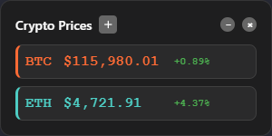
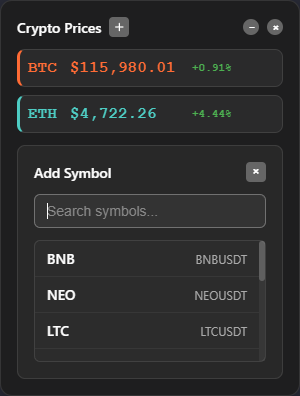
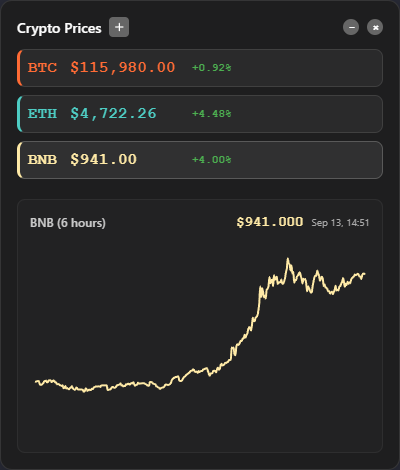

# CoinWidget

A Windows desktop widget that displays real-time cryptocurrency prices for Bitcoin (BTC) and Ethereum (ETH) using Electron and React.

## Features

- Real-time BTC & ETH price updates from Binance WebSocket API
- Interactive price charts with 6-hour historical data
- Always-on-top floating window
- Clean, minimal UI design with dark theme
- Windows system tray integration
- Draggable widget interface
- Auto-resizing window based on content
- Hover tooltips on price charts
- Configurable chart parameters

## Screenshots

### Default Widget View


### Add Symbol Interface


### Interactive Price Chart



## Development Setup

1. **Clone the repository:**
```bash
git clone <repository-url>
cd CoinWidget
```

2. **Install dependencies:**
```bash
npm install
```

3. **Run in development mode:**
```bash
npm run dev
```

## Build & Distribution

### For Development
```bash
# Build and run
npm run build
npm start

# Development mode with hot reload
npm run dev
```

### For Production Distribution
```bash
# Create Windows installer + portable version
npm run dist
# Output:
#   - release/CoinWidget Setup 1.0.0.exe (installer)
#   - release/win-unpacked/CoinWidget.exe (portable folder)

# Create only portable folder (no installer)
npm run dist-portable
# Output: release/win-unpacked/CoinWidget.exe (requires folder)

# Create single executable file
npm run dist-single
# Output: release/CoinWidget 1.0.0.exe (single file)
```

### Distribution Options

#### Windows Installer (Recommended for most users)
- **File**: `CoinWidget Setup 1.0.0.exe` (92 MB)
- **Features**: NSIS installer, desktop shortcut, Start Menu entry, uninstaller
- **Installation**: Double-click installer, follow wizard
- **Best for**: Regular users who want standard Windows app experience

#### Single Executable File (Ultimate portability)
- **File**: `CoinWidget 1.0.0.exe` (80 MB)
- **Features**: Self-extracting, runs anywhere, no dependencies, no admin rights needed
- **Usage**: Single file that runs on any Windows PC
- **Best for**: Maximum portability, sharing, USB drives, one-file distribution

#### Portable Folder (Developer testing)
- **File**: `win-unpacked/CoinWidget.exe` (202 MB folder)
- **Features**: Unpacked files, manual dependency management
- **Usage**: Copy entire folder to run
- **Best for**: Development testing, custom deployments

### Build Features
- **Professional Packaging**: Uses Electron Builder for Windows compatibility
- **Custom Icons**: Bitcoin-style branding throughout installer and app
- **Code Signing**: Executable signing for Windows security
- **System Tray**: Minimizes to system tray, appears in taskbar when active

## Project Structure

```
CoinWidget/
├── src/
│   ├── main/
│   │   └── main.ts              # Electron main process
│   ├── renderer/
│   │   ├── components/
│   │   │   ├── PriceWidget.tsx  # Main UI component
│   │   │   └── PriceChart.tsx   # Chart component
│   │   ├── styles/
│   │   │   └── app.css          # Styling
│   │   ├── App.tsx              # React root component
│   │   ├── index.tsx            # React entry point
│   │   └── index.html           # HTML template
│   └── shared/
│       ├── types.ts             # TypeScript type definitions
│       └── config.ts            # App configuration
├── dist/                        # Compiled output
├── package.json                 # Dependencies and scripts
├── tsconfig.json               # TypeScript configuration
├── webpack.config.js           # Webpack build configuration
└── release/                     # Built installers and packages
```

## Requirements

- Node.js 16 or higher
- Windows 10/11
- Internet connection for price data

## Technologies Used

- **Electron**: Desktop app framework
- **React**: UI library with hooks
- **TypeScript**: Type-safe JavaScript
- **Webpack**: Module bundler
- **Recharts**: Interactive chart library
- **Binance WebSocket API**: Real-time price streams
- **Binance REST API**: Historical price data
- **Electron Builder**: Windows packaging and distribution

## Available Commands

| Command | Description |
|---------|-------------|
| `npm run dev` | Development mode with hot reload |
| `npm run build` | Build application for production |
| `npm start` | Build and run the application |
| `npm run dist` | Create Windows installer + portable folder |
| `npm run dist-portable` | Create only portable folder (no installer) |
| `npm run dist-single` | Create single executable file (80 MB) |
| `npm run pack` | Package application without installer |

## Configuration

Chart and data parameters can be modified in `src/shared/config.ts`:

```typescript
export const CHART_CONFIG = {
  HISTORY_HOURS: 1,        // Hours of historical data
  INTERVAL_MINUTES: 1,     // Chart data interval
  BINANCE_INTERVAL: '1m',  // Binance API interval
  CHART_HEIGHT: 200        // Chart height in pixels
};
```

## License

ISC